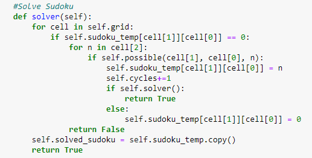
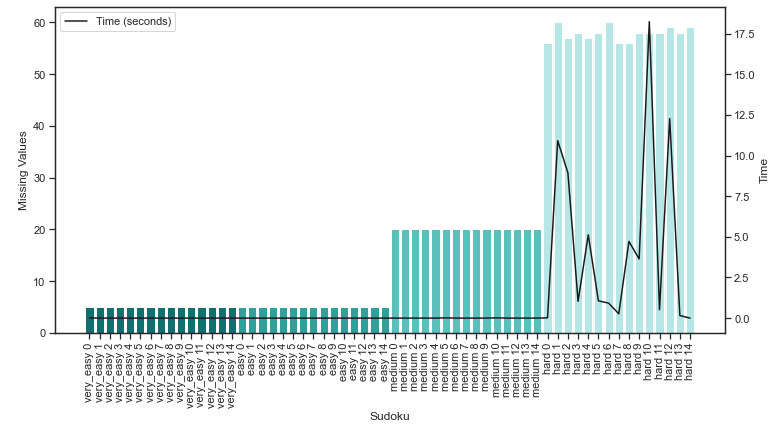
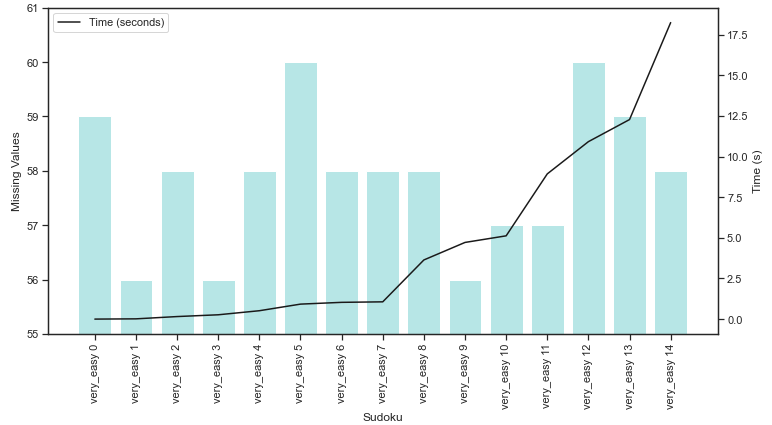
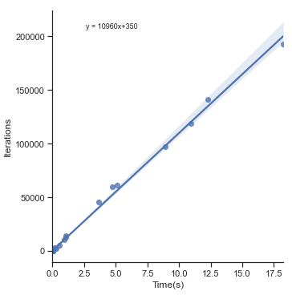
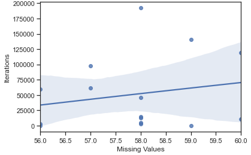

# Foundations of Artificial Intelligence - Solving Sudoku Puzzles
Date- 20/01/2020

### Abstract
In this assignment I was successful in my goal of using Python to create a backtracking constraint satisfaction based recursive function, able
to solve a range of sudoku's of increasing difficulty,each within a time limit of 30 seconds.

###Introduction
In creating code to solve sudokus, I aim to build an understanding of constraint satisfaction, and methods to impliment 
in a simple yet scalable way. An understanding of constraint satisfaction and it's underlying mathematics is
imperitive in order to understand the modern neural networks that are utilised in fields from visual object recognition to decision making (1).

### Method
The main approach for this assignment involved utilising the benefits of object orientated programming to create a 
single Sudoku (2) object that could be modified and tracked throughout solving. Initially the solver function (see below) was
able to solve all of the sudokus in required, however the time taken to solve, particularly for the 'hard' sudokus
was over the given threshold. The way the solver function worked, was to iterate through all of the cells of the
sudoku, check if a given number was possible in that cell (check if the constraints were satisfied) and if it was it 
continue with the rest of the cells. If no numbers were possible in that cell, the function would use it's recursive
nature to backtrack (3) to the last cell that had a number inputted, and continue to iterate values in that cell. Through
these steps, the function will either output a solved sudoku or an unsolved sudoku if a solution is not possible.
It is therefore necessary to have another function to check the validity of the function, that will complete in O(n), 
as it only needs to run through the sudoku once to look for mistakes. The solver function itself will find a solution in
O(n^m) where n is the number of viable inputs to each cell and m is the number of blank spaces in the sudoku.

*Fig. 1: Python code showing the constraint satisfaction based recursive function used in this assignment.*

In order to improve the solve time, a certain amount of preprocessing was necessary to 
reduce the number of iterations (see self.cycles) the code needed to solve. This preprocessing was performed in 
3 steps:

    1. Calculate the initial possible values for each cell in the sudoku.

    2. Order these numbers by the most common numbers in the initial sudoku, and trial them in this order in
       the solver function.

    3. If there is a row or column or block in the sudoku that only has one value missing, fill this number
       in immediately and remove from the cells that are iterated through.
     
    4. Loop over the above steps, until no more cells are removed. At this point check if the sudoku has been 
       solved, and if not, move on to the solver function.
       
The main purpose of these preprocessing steps is to reduce the total number of iterations the recursive function
needs to iterate through, therefore decreasing the time taken to solve. A number of further steps were trialled, such
as ordering the cells trialled by the ones with the fewest possible numbers, as well as calculating a few of these
metrics during the solving process. These were not included above as they were unsuccessful in speeding up the algorithm.
As we can see from the algorithm complexity of the solver solution above, steps 1 and 2 work to reduce n, and steps
3 and 4 work to reduce m. These steps altogether were successful in reducing the complexity to the point where all
of the hard sudokus solved comfortably under the time limit.
### Results
It can be seen that there is a rough positive correlation with total number of missing values and time taken to solve.
However as all problems that weren't of a hard nature were solved in well under a second, a closer look at the harder 
sudokus is needed.

*Fig. 2: Overall results showing the number of missing values of each problem and the time taken to solve.*

When we order the sudokus by how long they took to solve, we see that there isnt a strong correlation shown when comparing
time to solve and the initial number of missing values. We would expect the time to solve to be consistent with O(n^m). 
However as n has been reduced in this code to be <=9, we cannot track the correlation with m (number of missing values)
with this number of sudokus. Individual sudoku characteristics make too much of a sizable difference when the sample size 
is too small.

*Fig. 3:A breakdown of Fig2 only showing the 'hard' sudokus*

Figures 4 and 5 can be used together to determine that although there is a statistically significant relation between
the initial number of missing values and the total time to solve, it does not follow the relation we would expect from 
the algorithm complexity and instead shows a linear relationship. 

*Fig. 4: Graph validating the strong positive correlation between the time taken to solve and the
the number of iterations taken to solve. Intuitively this makes sense, but we can also use the y-intercept to track the
number of iterations that could be done in the time it takes for pre and post processing of the sudoku*

*Fig. 5: A slight positive correlation can be seen comparing missing values and iterations to solve. A p-value of 
1.125e-06 shows the correlation is significant enough to further this project*

### Conclusion
The aim of creating an algorithm in python to solve all given sudokus in under 30 seconds was successful. A combination of 
backtracking and constraint satisfaction were used in order to do this. However, it was seen in the results that the
algorithm complexity O(n^m) was not fully represented in the time taken to complete the sudokus or the number of iterations 
taken to complete the sudoku. In order to correct for this, one would require access to a greater number of sudokus in
 order to more accurately calculate the curve between number of missing values and iterations to solve.

### References
1. Shultz, T., 2001. Constraint Satisfaction Models. International Encyclopedia of the Social & Behavioral Sciences, pp.2648-2651.

2. Anon, 2021. Sudoku Rules for Complete Beginners | Play Free Sudoku, a Popular Online Puzzle Game. [online] Sudoku.com. Available from: https://sudoku.com/how-to-play/sudoku-rules-for-complete-beginners/ [Accessed 30 Jan. 2021].

3. Civicioglu, P., 2013. Backtracking Search Optimization Algorithm for numerical optimization problems. Applied Mathematics and Computation, 219(15), pp.8121-8144.

###Appendix
##### Raw data from sudoku solving code output

very_easy problem-0 took 0.015625 seconds to solve and 0 iterations. Starting sudoku contains 5 zeros 

very_easy problem-1 took 0.0 seconds to solve and 0 iterations. Starting sudoku contains 5 zeros 

very_easy problem-2 took 0.0 seconds to solve and 0 iterations. Starting sudoku contains 5 zeros 

very_easy problem-3 took 0.0 seconds to solve and 0 iterations. Starting sudoku contains 5 zeros 

very_easy problem-4 took 0.0 seconds to solve and 0 iterations. Starting sudoku contains 5 zeros 

very_easy problem-5 took 0.0 seconds to solve and 0 iterations. Starting sudoku contains 5 zeros 

very_easy problem-6 took 0.0 seconds to solve and 0 iterations. Starting sudoku contains 5 zeros 

very_easy problem-7 took 0.0 seconds to solve and 0 iterations. Starting sudoku contains 5 zeros 

very_easy problem-8 took 0.0 seconds to solve and 0 iterations. Starting sudoku contains 5 zeros 

very_easy problem-9 took 0.0 seconds to solve and 0 iterations. Starting sudoku contains 5 zeros 

very_easy problem-10 took 0.0 seconds to solve and 0 iterations. Starting sudoku contains 5 zeros 

very_easy problem-11 took 0.0 seconds to solve and 0 iterations. Starting sudoku contains 5 zeros 

very_easy problem-12 took 0.0 seconds to solve and 0 iterations. Starting sudoku contains 5 zeros 

very_easy problem-13 took 0.0 seconds to solve and 0 iterations. Starting sudoku contains 5 zeros 

very_easy problem-14 took 0.015625 seconds to solve and 0 iterations. Starting sudoku contains 5 zeros 

easy problem-0 took 0.0 seconds to solve and 0 iterations. Starting sudoku contains 5 zeros 

easy problem-1 took 0.0 seconds to solve and 0 iterations. Starting sudoku contains 5 zeros 

easy problem-2 took 0.0 seconds to solve and 0 iterations. Starting sudoku contains 5 zeros 

easy problem-3 took 0.0 seconds to solve and 0 iterations. Starting sudoku contains 5 zeros 

easy problem-4 took 0.0 seconds to solve and 0 iterations. Starting sudoku contains 5 zeros 

easy problem-5 took 0.0 seconds to solve and 0 iterations. Starting sudoku contains 5 zeros 

easy problem-6 took 0.0 seconds to solve and 0 iterations. Starting sudoku contains 5 zeros 

easy problem-7 took 0.015625 seconds to solve and 0 iterations. Starting sudoku contains 5 zeros 

easy problem-8 took 0.0 seconds to solve and 0 iterations. Starting sudoku contains 5 zeros 

easy problem-9 took 0.0 seconds to solve and 0 iterations. Starting sudoku contains 5 zeros 

easy problem-10 took 0.0 seconds to solve and 0 iterations. Starting sudoku contains 5 zeros 

easy problem-11 took 0.0 seconds to solve and 0 iterations. Starting sudoku contains 5 zeros 

easy problem-12 took 0.0 seconds to solve and 0 iterations. Starting sudoku contains 5 zeros 

easy problem-13 took 0.0 seconds to solve and 0 iterations. Starting sudoku contains 5 zeros 

easy problem-14 took 0.015625 seconds to solve and 0 iterations. Starting sudoku contains 5 zeros 

medium problem-0 took 0.0 seconds to solve and 0 iterations. Starting sudoku contains 20 zeros 

medium problem-1 took 0.0 seconds to solve and 0 iterations. Starting sudoku contains 20 zeros 

medium problem-2 took 0.015625 seconds to solve and 0 iterations. Starting sudoku contains 20 zeros 

medium problem-3 took 0.0 seconds to solve and 0 iterations. Starting sudoku contains 20 zeros 

medium problem-4 took 0.0 seconds to solve and 0 iterations. Starting sudoku contains 20 zeros 

medium problem-5 took 0.0 seconds to solve and 0 iterations. Starting sudoku contains 20 zeros 

medium problem-6 took 0.0 seconds to solve and 0 iterations. Starting sudoku contains 20 zeros 

medium problem-7 took 0.015625 seconds to solve and 0 iterations. Starting sudoku contains 20 zeros 

medium problem-8 took 0.0 seconds to solve and 0 iterations. Starting sudoku contains 20 zeros 

medium problem-9 took 0.0 seconds to solve and 0 iterations. Starting sudoku contains 20 zeros 

medium problem-10 took 0.0 seconds to solve and 0 iterations. Starting sudoku contains 20 zeros 

medium problem-11 took 0.0 seconds to solve and 0 iterations. Starting sudoku contains 20 zeros 

medium problem-12 took 0.015625 seconds to solve and 0 iterations. Starting sudoku contains 20 zeros 

medium problem-13 took 0.0 seconds to solve and 0 iterations. Starting sudoku contains 20 zeros 

medium problem-14 took 0.0 seconds to solve and 0 iterations. Starting sudoku contains 20 zeros 

hard problem-0 took 0.015625 seconds to solve and 0 iterations. Starting sudoku contains 56 zeros 

hard problem-1 took 10.9375 seconds to solve and 118759 iterations. Starting sudoku contains 60 zeros 

hard problem-2 took 9.046875 seconds to solve and 97473 iterations. Starting sudoku contains 57 zeros 

hard problem-3 took 1.046875 seconds to solve and 14567 iterations. Starting sudoku contains 58 zeros 

hard problem-4 took 5.203125 seconds to solve and 61076 iterations. Starting sudoku contains 57 zeros 

hard problem-5 took 1.078125 seconds to solve and 12776 iterations. Starting sudoku contains 58 zeros 

hard problem-6 took 0.9375 seconds to solve and 10340 iterations. Starting sudoku contains 60 zeros 

hard problem-7 took 0.28125 seconds to solve and 2523 iterations. Starting sudoku contains 56 zeros 

hard problem-8 took 4.796875 seconds to solve and 59945 iterations. Starting sudoku contains 56 zeros 

hard problem-9 took 3.71875 seconds to solve and 45452 iterations. Starting sudoku contains 58 zeros 

hard problem-10 took 18.421875 seconds to solve and 192845 iterations. Starting sudoku contains 58 zeros 

hard problem-11 took 0.546875 seconds to solve and 5097 iterations. Starting sudoku contains 58 zeros 

hard problem-12 took 12.515625 seconds to solve and 140902 iterations. Starting sudoku contains 59 zeros 

hard problem-13 took 0.140625 seconds to solve and 2870 iterations. Starting sudoku contains 58 zeros 

hard problem-14 took 0.0 seconds to solve and 26 iterations. Starting sudoku contains 59 zeros 